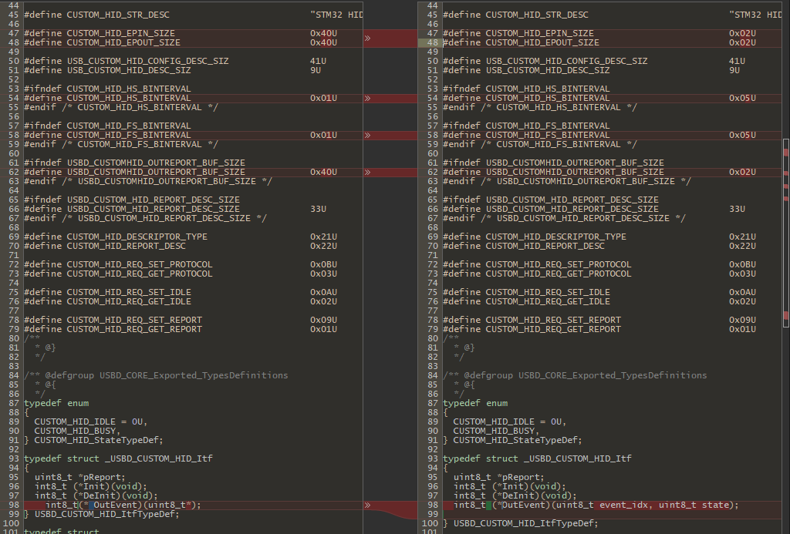
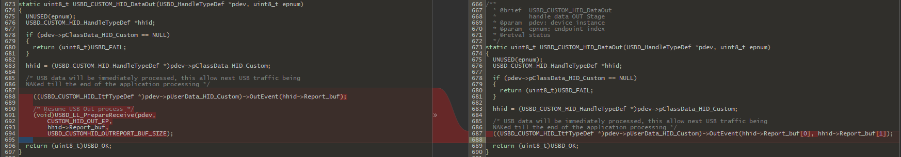
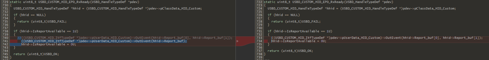
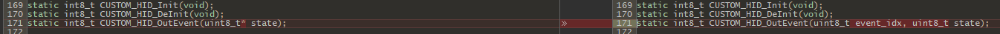
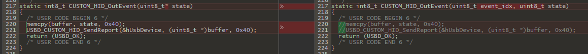
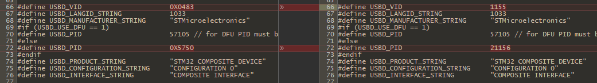

# STM32 USB Composite Device Driver Test

STM32 USB Composite Device Driver Modification

## Target Device

**STM32F411CE**

## Enviroment

- IDE : Visual Studio + VisualGDB
- USB Composite Device Driver:  [I-CUBE-USBD-Composite](https://github.com/alambe94/I-CUBE-USBD-Composite#i-cube-usbd-composite)

## Custom HID Driver Modification

### Middlewares\Third_Party\AL94_USB_Composite\COMPOSITE\Class\HID_CUSTOM\Inc\usbd_hid_custom.h



```clike=
#define CUSTOM_HID_STR_DESC                          "STM32 HID CUSTOM"

#define CUSTOM_HID_EPIN_SIZE                         0x40U
#define CUSTOM_HID_EPOUT_SIZE                        0x40U

#define USB_CUSTOM_HID_CONFIG_DESC_SIZ               41U
#define USB_CUSTOM_HID_DESC_SIZ                      9U

#ifndef CUSTOM_HID_HS_BINTERVAL
#define CUSTOM_HID_HS_BINTERVAL                      0x01U
#endif /* CUSTOM_HID_HS_BINTERVAL */

#ifndef CUSTOM_HID_FS_BINTERVAL
#define CUSTOM_HID_FS_BINTERVAL                      0x01U
#endif /* CUSTOM_HID_FS_BINTERVAL */

#ifndef USBD_CUSTOMHID_OUTREPORT_BUF_SIZE
#define USBD_CUSTOMHID_OUTREPORT_BUF_SIZE            0x40U
#endif /* USBD_CUSTOMHID_OUTREPORT_BUF_SIZE */

#ifndef USBD_CUSTOM_HID_REPORT_DESC_SIZE
#define USBD_CUSTOM_HID_REPORT_DESC_SIZE             33U
#endif /* USBD_CUSTOM_HID_REPORT_DESC_SIZE */

#define CUSTOM_HID_DESCRIPTOR_TYPE                   0x21U
#define CUSTOM_HID_REPORT_DESC                       0x22U

#define CUSTOM_HID_REQ_SET_PROTOCOL                  0x0BU
#define CUSTOM_HID_REQ_GET_PROTOCOL                  0x03U

#define CUSTOM_HID_REQ_SET_IDLE                      0x0AU
#define CUSTOM_HID_REQ_GET_IDLE                      0x02U

#define CUSTOM_HID_REQ_SET_REPORT                    0x09U
#define CUSTOM_HID_REQ_GET_REPORT                    0x01U
```

```clike=
typedef struct _USBD_CUSTOM_HID_Itf
{
  uint8_t *pReport;
  int8_t (*Init)(void);
  int8_t (*DeInit)(void);
	int8_t(* OutEvent)(uint8_t*);
} USBD_CUSTOM_HID_ItfTypeDef;
```

### Middlewares\Third_Party\AL94_USB_Composite\COMPOSITE\Class\HID_CUSTOM\Src\usbd_hid_custom.c



```cpp=
static uint8_t USBD_CUSTOM_HID_DataOut(USBD_HandleTypeDef *pdev, uint8_t epnum)
{
  UNUSED(epnum);
  USBD_CUSTOM_HID_HandleTypeDef *hhid;

  if (pdev->pClassData_HID_Custom == NULL)
  {
    return (uint8_t)USBD_FAIL;
  }

  hhid = (USBD_CUSTOM_HID_HandleTypeDef *)pdev->pClassData_HID_Custom;

  /* USB data will be immediately processed, this allow next USB traffic being
  NAKed till the end of the application processing */

((USBD_CUSTOM_HID_ItfTypeDef *)pdev->pUserData_HID_Custom)->OutEvent(hhid->Report_buf);

/* Resume USB Out process */
(void)USBD_LL_PrepareReceive(pdev,
    CUSTOM_HID_OUT_EP,
    hhid->Report_buf,
    USBD_CUSTOMHID_OUTREPORT_BUF_SIZE);	
    return (uint8_t)USBD_OK;
}
```

```cpp=
static uint8_t USBD_CUSTOM_HID_EP0_RxReady(USBD_HandleTypeDef *pdev)
{
  USBD_CUSTOM_HID_HandleTypeDef *hhid = (USBD_CUSTOM_HID_HandleTypeDef *)pdev->pClassData_HID_Custom;

  if (hhid == NULL)
  {
    return (uint8_t)USBD_FAIL;
  }

  if (hhid->IsReportAvailable == 1U)
  {
    //((USBD_CUSTOM_HID_ItfTypeDef *)pdev->pUserData_HID_Custom)->OutEvent(hhid->Report_buf[0], hhid->Report_buf[1]);
    ((USBD_CUSTOM_HID_ItfTypeDef *)pdev->pUserData_HID_Custom)->OutEvent(hhid->Report_buf);
    hhid->IsReportAvailable = 0U;
  }

  return (uint8_t)USBD_OK;
}
```

### Middlewares\Third_Party\AL94_USB_Composite\COMPOSITE\App\usbd_hid_custom_if.c




```clike=
static int8_t CUSTOM_HID_Init(void);
static int8_t CUSTOM_HID_DeInit(void);
static int8_t CUSTOM_HID_OutEvent(uint8_t* state);
```

```clike=
static int8_t CUSTOM_HID_OutEvent(uint8_t* state)
{
  /* USER CODE BEGIN 6 */
  memcpy(buffer, state, 0x40);
  USBD_CUSTOM_HID_SendReport(&hUsbDevice, (uint8_t *)buffer, 0x40);
  return (USBD_OK);
  /* USER CODE END 6 */
}
```

### Middlewares\Third_Party\AL94_USB_Composite\COMPOSITE\App\usbd_desc.c

**Just Change VID & PID**



## Main.c

Add the following to main.c
```clike=
MX_USB_DEVICE_Init(); 
```

## Send & Receive HID Report

Send to Host

```clike=
USBD_CUSTOM_HID_SendReport(&hUsbDevice, (uint8_t *)buffer, 0x40);
```

Received From Host
`D:\Temp\stm32\stm32f411_composite\Middlewares\Third_Party\AL94_USB_Composite\COMPOSITE\App\usbd_hid_custom_if.c`

```clike=
static int8_t CUSTOM_HID_OutEvent(uint8_t* state)
{
  /* USER CODE BEGIN 6 */
  memcpy(buffer, state, 0x40);
  USBD_CUSTOM_HID_SendReport(&hUsbDevice, (uint8_t *)buffer, 0x40);
  return (USBD_OK);
  /* USER CODE END 6 */
}
```

## References

- [Creating Advanced STM32CubeMX-based Projects with VisualGDB](https://visualgdb.com/tutorials/arm/stm32/cube/advanced/)
- [Use VisualGDB in Visual Studio](https://hackmd.io/@billwang168/rkrNWltBs)
- [I-CUBE-USBD-Composite](https://github.com/alambe94/I-CUBE-USBD-Composite#i-cube-usbd-composite)